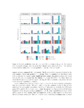
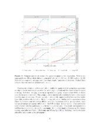
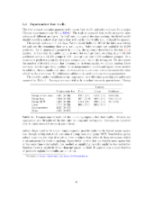

---

*Publications*

**Robust subset selection**  
Ryan Thompson  
Computational Statistics and Data Analysis, 2022 [[arXiv](https://arxiv.org/abs/2005.08217)]

**Optimal selection of expert forecasts with integer programming**  
Dmytro Matsypura, Ryan Thompson, and Andrey Vasnev  
Omega, 2018 [[SSRN](https://papers.ssrn.com/sol3/papers.cfm?abstract_id=2894083)]

*Preprints*

**Global combinations of expert forecasts**  
Yilin Qian, Ryan Thompson, and Andrey Vasnev  
2022 [[arXiv](https://arxiv.org/abs/2207.07318)]

**Familial inference**  
Ryan Thompson, Catherine Forbes, Steven MacEachern, and Mario Peruggia  
2022 [[arXiv](https://arxiv.org/abs/2202.12540)]

**Group selection and shrinkage: Structured sparsity for semiparametric models**  
Ryan Thompson and Farshid Vahid  
2022 [[arXiv](https://arxiv.org/abs/2105.12081)]

---

<small>Last updated: `r format(Sys.time(), '%B %d, %Y')`.</small>
